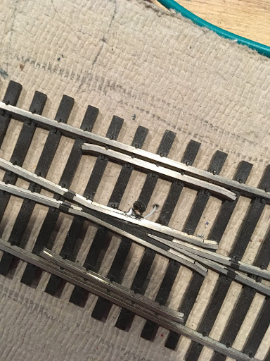

# Rail_Conn_Sensing
A circuit to sense which forks of a train track are connected for a minature train set

## Engineers
@RileyZito and @wwc559

Documentation of design, part ordering, and project here: https://drive.google.com/drive/folders/1-3am_OTXkoIcgUFlx-CCv6cNEhRWZZK8?usp=sharing
